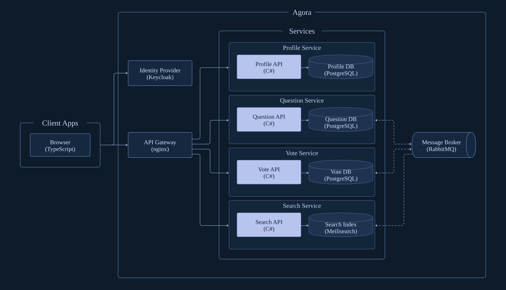

# agora

Agora is a Q&A app (similar to Stack Overflow).

This is a learning project. The goal is to build something real enough to run into some of the problems and tradeoffs of microservices: data ownership, eventual consistency, the dual-write problem, duplicate message delivery and replicated read models.

## System architecture



- **Solid**: synchronous call (the arrow points from the caller to the callee)
- **Dashed**: asynchronous message (the arrow points in the direction the message travels)

## Quick start

```bash
# root env for infrastructure
cp .env.example .env

# env for each service
cp src/services/QuestionSvc/.env.example src/services/QuestionSvc/.env
cp src/services/SearchSvc/.env.example   src/services/SearchSvc/.env
cp src/services/ProfileSvc/.env.example  src/services/ProfileSvc/.env
cp src/services/VoteSvc/.env.example     src/services/VoteSvc/.env

# build + start everything
make up # runs the web app on http://localhost:5173
```
